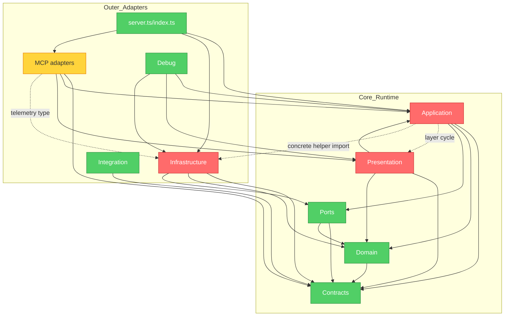
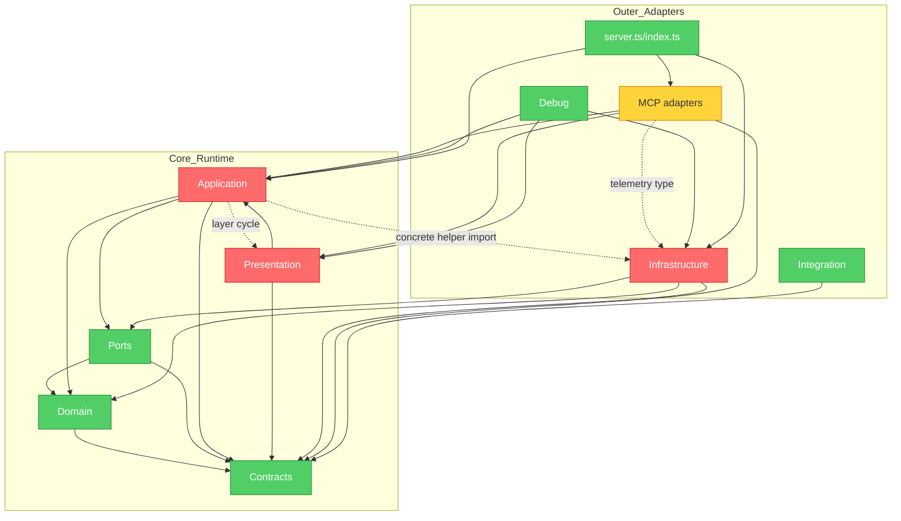

# Findings Ledger

## 2026-06-06 Brooks-Lint Review

**Mode:** Architecture Audit
**Scope:** Entire project, focused on `src/`, durable architecture documents,
and `tests/architecture/layer-boundaries.test.ts`
**Health Score:** 65/100
**Trend:** First run - no trend data.

The runtime has clear documented layering and useful boundary tests, but three
dependency-direction problems are already visible and one of them is masked by
an import-parser blind spot in the current test.

---

## Module Dependency Graph



---

## Findings

### Critical

#### BL-ARCH-001: Dependency Disorder - Application Imports Concrete Markdown Infrastructure

Status: `resolved`

Triage rationale: Accepted. The finding matches the repository's documented
layer direction and the running evidence shows the current architecture test
can pass while missing the multiline imports. Remediation stays sequenced
behind `T003` so the executable boundary test is strengthened before any code
movement.

Symptom: `src/application/use-cases/index-repository-graph.ts` and
`src/application/use-cases/query-docs.ts` import Markdown helper functions from
`../../infrastructure/markdown/docs.js`. The documented architecture says
application use cases depend on domain policies and ports, not concrete
infrastructure. The existing architecture test intends to forbid
`src/infrastructure` imports from `src/application`, but the current
line-oriented import extractor misses these multiline import declarations.

Source: Clean Architecture - Dependency Rule and Dependency Inversion
Principle; A Philosophy of Software Design - Information Leakage.

Consequence: Markdown parsing and document selection details become application
policy by accident. Replacing or reorganizing Markdown infrastructure would
require changes in use cases, and the current test can pass while a documented
boundary is violated.

Remedy: Decide whether these helpers are pure document policy or concrete
infrastructure. Move pure helpers into an application/domain-owned module, or
introduce a narrow port for infrastructure-owned behavior. Update
`tests/architecture/layer-boundaries.test.ts` so multiline imports are checked
and application-to-infrastructure imports fail.

Tasks: `T002`, `T003`

Verification: 2026-06-11 `T003` moved pure Markdown document helpers to
`src/application/use-cases/markdown-docs.ts`, replaced regex import extraction
with TypeScript AST extraction, and passed targeted architecture/docs tests and
`pnpm typecheck`. `T006` aggregate validation passed, and `T007` promoted
ownership to `docs/design/layered-runtime-architecture.md` with map pointers in
`docs/architecture/system-architecture.md` and
`docs/reference/documentation-map.md`.

#### BL-ARCH-002: Dependency Disorder - Application And Presentation Form A Layer Cycle

Status: `resolved`

Triage rationale: Accepted. Application imports from `src/presentation` create
an inward dependency on response metadata vocabulary and contradict the
documented presentation-to-application direction. Remediation stays sequenced
behind `T004` after `T003` makes the boundary test capable of enforcing the
rule.

Symptom: Multiple application use cases import `capNextActions`,
`invalidResponseMeta`, or `uniqueSorted` from
`src/presentation/metadata.ts`, while presenters import application result
types from use-case modules. Durable docs define the direction as
`presentation -> application`, with use cases returning application result
objects and presenters composing response metadata and envelopes.

Evidence includes:

- `src/application/use-cases/compute-impact.ts`
- `src/application/use-cases/get-repo-status.ts`
- `src/application/use-cases/query-helpers.ts`
- `src/application/use-cases/find-references.ts`
- `src/application/use-cases/get-task-context.ts`
- `src/application/use-cases/build-post-edit-feedback.ts`
- `src/application/use-cases/query-docs.ts`
- `src/application/use-cases/plan-verification.ts`
- `src/application/use-cases/search-symbols.ts`
- `src/presentation/status-presenter.ts`

Source: Clean Architecture - Acyclic Dependencies Principle and Dependency
Rule; The Mythical Man-Month - Conceptual Integrity; A Philosophy of Software
Design - Information Leakage.

Consequence: Presentation vocabulary leaks into use-case policy, so response
metadata or next-action behavior can require edits in both layers. The cycle
also weakens the architecture rule that presenters own response composition,
making future feature placement less obvious.

Remedy: Move shared next-action and metadata primitives to `src/contracts` or
an application-owned policy module, depending on ownership, while keeping
response-envelope construction in `src/presentation`. Add a boundary test that
forbids application imports of `src/presentation`.

Tasks: `T002`, `T004`

Verification: 2026-06-11 `T004` moved response metadata and next-action policy
to `src/application/use-cases/response-metadata.ts`, updated presenters to
depend inward on that module, added an application boundary rule forbidding
`src/presentation` imports, and passed targeted architecture/metadata checks,
`pnpm typecheck`, and `pnpm test`. `T006` aggregate validation passed, and
`T007` promoted ownership to `docs/design/layered-runtime-architecture.md`
with map pointers in `docs/architecture/system-architecture.md` and
`docs/reference/documentation-map.md`.

### Warning

#### BL-ARCH-003: Dependency Disorder - MCP Adapters Depend On Concrete Telemetry Type

Status: `resolved`

Triage rationale: Accepted for explicit boundary decision. The current MCP
adapter dependency is type-only, but it still points at a concrete
infrastructure module where a port abstraction or documented exception should
own the contract. `T005` will decide whether to move telemetry behind
`src/ports` or encode a durable exception with a matching boundary test.

Symptom: `src/interface-adapters/mcp/server.ts` and
`src/interface-adapters/mcp/instrumentation.ts` import the `TelemetryAdapter`
type from `src/infrastructure/telemetry/index.ts`. The MCP layer is an outer
interface adapter, but this dependency still makes its public constructor shape
aware of a concrete infrastructure module instead of a port abstraction.

Source: Clean Architecture - Dependency Inversion Principle; Software
Engineering at Google - Dependency Management.

Consequence: Telemetry implementation details become part of the MCP adapter
contract. A future telemetry replacement or split could require edits in MCP
adapter code even when behavior should be hidden behind a stable port.

Remedy: Move the telemetry abstraction needed by MCP adapters to `src/ports`
and have `src/infrastructure/telemetry` implement that port. If telemetry is an
intentional adapter-level exception, document the exception and add a boundary
test that encodes it explicitly.

Tasks: `T002`, `T005`

Verification: 2026-06-11 `T005` added `TelemetryRecorderPort` in `src/ports`,
made the infrastructure telemetry adapter implement that port, changed MCP
server and instrumentation imports to the port abstraction, broadened the MCP
adapter boundary test to forbid concrete infrastructure imports, and passed
focused telemetry/architecture tests, `pnpm typecheck`, and `pnpm test`. `T006`
aggregate validation passed, and `T007` promoted ownership to
`docs/design/layered-runtime-architecture.md` with map pointers in
`docs/architecture/system-architecture.md` and
`docs/reference/documentation-map.md`.

---

## Summary

The most important action is to tighten the executable architecture boundary
test before moving code, because the current test passes while missing a
documented application-to-infrastructure violation. After the test is capable
of seeing multiline imports and application-to-presentation edges, remediation
can move metadata, Markdown, and telemetry abstractions to the layer that owns
each concept.

## Running Evidence

- `pnpm exec vitest run tests/architecture/layer-boundaries.test.ts` passed on
  2026-06-06 with 1 test file and 5 tests passing.
- No `.brooks-lint.yaml` project configuration was present.

## 2026-06-06 Brooks-Lint Tech Debt Assessment

**Mode:** Tech Debt Assessment
**Scope:** Entire project, focused on `src/` module size, validation planning,
resource extraction, contract surface area, and existing architecture evidence
**Health Score:** 75/100
**Trend:** First run - no trend data.

The clearest debt is concentrated in a few high-value modules that have grown
to absorb multiple independent reasons to change. The project still has strong
tests and explicit architecture docs, so the recommended path is incremental
extraction behind current contracts rather than broad rewrites.

---

## Findings

### Critical

#### BL-DEBT-001: Cognitive Overload - Validation Planning Is A Multi-Ecosystem Planning Module

Status: `in_progress`

Triage rationale: Accepted. The module currently owns multiple independent
validation concerns, and the remediation task is already scoped to extraction
behind the existing planning path instead of adding alternate planners.

Pain x Spread: `2 x 3 = 6` scheduled debt.

Intent: `accidental`

Symptom: `src/application/use-cases/plan-verification.ts` is 1,776 lines and
contains the public use case plus command planning, static feedback,
environment policy discovery, package script selection, Markdown validation
planning, .NET project routing, CMake target discovery, Go workflow discovery,
Python nearest-test discovery, SAM template routing, package manager detection,
and unsafe target checks. The helper list includes more than 50 local functions
in one module.

Source: Fowler - Long Method and Divergent Change; Code Complete - routine
size and abstraction-level discipline; A Philosophy of Software Design -
Tactical Programming.

Consequence: Adding or changing one validation ecosystem requires editing the
same module that owns unrelated ecosystems and blocking policy. That raises
review cost, increases regression risk across unrelated validation paths, and
makes the use case harder to reason about without reading most of the file.

Remedy: Extract validation discovery and command planning into focused
application-owned modules by concern, for example environment policy, package
scripts, language-specific target selection, and static feedback. Preserve one
explicit planning path and current response contracts; do not add fallback
planners. Add focused fixture tests for each extracted planner before changing
behavior.

Tasks: `T009`, `T010`

Verification: 2026-06-11 `T010` split validation planning into focused
application modules for shared validation utilities, static feedback,
environment/policy discovery, package scripts, and ecosystem target selection.
The public `planVerification` path and response contracts stayed unchanged.
`pnpm exec vitest run tests/mcp/verification-plan-tool.test.ts`,
`pnpm typecheck`, and `pnpm test` passed. Keep status `in_progress` until
debt remediation is promoted or closed with the remaining debt tasks.

### Warning

#### BL-DEBT-002: Change Propagation - Resource Extraction Mixes Unrelated Resource Domains

Status: `in_progress`

Triage rationale: Accepted. The adapter mixes independent resource domains
behind one implementation class. `T011` keeps the existing `ExtractorPort`
contract stable while splitting the internal domain ownership.

Pain x Spread: `2 x 2 = 4` scheduled debt.

Intent: `accidental`

Symptom: `src/infrastructure/extraction/resource-extractor.ts` is 1,060 lines
and one `ResourceExtractorAdapter` handles generic resource nodes, .NET
solutions/projects, CloudFormation/SAM parsing and intrinsic references, CMake
target extraction, XML scanning, YAML traversal, secret-looking value checks,
and node range helpers.

Source: Fowler - Divergent Change; Clean Architecture - Single Responsibility
Principle; A Philosophy of Software Design - Information Hiding.

Consequence: Adding a new resource-backed format or changing CloudFormation
behavior risks touching the same adapter and tests used by unrelated .NET or
CMake extraction behavior. The adapter boundary hides little of the internal
domain split, so unrelated extractor concerns can regress together.

Remedy: Split resource-backed extraction into focused infrastructure adapters
or internal modules for generic resources, .NET project evidence,
CloudFormation/SAM evidence, and CMake evidence. Keep the existing
`ExtractorPort` contract and registry behavior stable while moving code.

Tasks: `T009`, `T011`

Verification: 2026-06-11 `T011` kept `ResourceExtractorAdapter` as the stable
`ExtractorPort` implementation and split domain extraction into generic
resource coordination, `.NET` project/solution metadata,
CloudFormation/SAM template parsing and intrinsic references, CMake targets,
and shared resource helpers. Targeted resource-domain tests, `pnpm typecheck`,
and `pnpm test` passed. Keep status `in_progress` until debt remediation is
promoted or closed with the remaining debt tasks.

#### BL-DEBT-003: Change Propagation - Runtime Contracts Are A Multi-Context Schema Monolith

Status: `in_progress`

Triage rationale: Accepted. Centralized contract vocabulary remains the right
public API shape, but the implementation file should be split by stable runtime
context while preserving the `src/contracts/index.ts` compatibility barrel.

Pain x Spread: `2 x 2 = 4` scheduled debt.

Intent: `intentional, but without a visible payback split`

Symptom: `src/contracts/runtime-contracts.ts` is 1,310 lines and defines shared
enums, response metadata, task context, repo scope, docs, symbols,
references, impact, verification, diagnostics, edit, integration, and Markdown
quality schemas in one file. The repository intentionally centralizes shared
contract vocabulary, but this file now crosses many runtime contexts.

Source: Software Engineering at Google - Hyrum's Law and code sustainability;
The Pragmatic Programmer - DRY as knowledge ownership; A Philosophy of
Software Design - Shallow Module pressure when an interface grows too broad.

Consequence: Any contract change requires navigating a large file that mixes
unrelated surfaces. The file can become a merge-conflict and review hot spot,
and a local schema change can accidentally expose or couple vocabulary across
unrelated MCP tools.

Remedy: Split contracts by stable runtime context, such as core metadata,
context/orientation, docs, graph queries, validation, edits, integration, and
Markdown quality, while keeping `src/contracts/index.ts` as the compatibility
barrel. Add drift tests that prove public exports and contract schemas remain
stable during the split.

Tasks: `T009`, `T012`

Verification: 2026-06-11 `T012` split runtime contracts into context modules
for core primitives, orientation/repo overview, docs and Markdown quality,
graph queries, validation/edit feedback, response envelopes, and integration
profiles while keeping `src/contracts/runtime-contracts.ts` and
`src/contracts/index.ts` as compatibility barrels. Added export compatibility
coverage in `tests/contracts/runtime-contracts.test.ts`, updated
`docs/reference/runtime-contracts.md`, and passed
`pnpm exec vitest run tests/contracts/runtime-contracts.test.ts`,
`pnpm typecheck`, and `pnpm test`. Keep status `in_progress` until debt
remediation is promoted or closed with the remaining debt tasks.

---

## Debt Summary

| Risk | Findings | Avg Priority | Classification | Intent |
|------|----------|--------------|----------------|--------|
| Cognitive Overload | 1 | 6.0 | Scheduled | accidental |
| Change Propagation | 2 | 4.0 | Scheduled | mixed |
| Knowledge Duplication | 0 | 0.0 | Monitored | none observed |
| Accidental Complexity | 0 | 0.0 | Monitored | none observed |
| Dependency Disorder | 0 | 0.0 | Monitored | tracked in architecture audit |
| Domain Model Distortion | 0 | 0.0 | Monitored | none observed |

**Recommended focus:** Start with validation planning, because it has the
highest spread and is likely to keep growing as Agent Workbench learns more
repository ecosystems. Then split resource extraction and contract schemas only
behind existing ports and barrels.

## Running Evidence

- Largest source modules by line count on 2026-06-06:
  `src/infrastructure/sqlite/graph-store.ts` at 1,952 lines,
  `src/application/use-cases/plan-verification.ts` at 1,776 lines,
  `src/contracts/runtime-contracts.ts` at 1,310 lines, and
  `src/infrastructure/extraction/resource-extractor.ts` at 1,060 lines.
- `src/application/use-cases/plan-verification.ts` contains validation logic
  for JavaScript/TypeScript package scripts, Python tests, .NET projects,
  CMake targets, SAM templates, Go workflow commands, environment policy, and
  static feedback.
- No `.brooks-lint.yaml` project configuration was present.

## 2026-06-06 Brooks-Lint Health Dashboard

**Mode:** Health Dashboard
**Scope:** Entire project, with Code Quality limited to the current docs-only
working-tree change
**Composite Score:** 82/100

| Dimension | Score | Top Finding |
|-----------|-------|-------------|
| Code Quality | 100/100 | Current working-tree change is docs/spec tracking only |
| Architecture | 65/100 | `BL-ARCH-001`: application imports concrete Markdown infrastructure |
| Tech Debt | 75/100 | `BL-DEBT-001`: validation planning is a multi-ecosystem planning module |
| Test Quality | 95/100 | `BL-HEALTH-001`: large MCP/integration tests repeat internal harness access |

The composite score uses the Health Dashboard weights: Code Quality 0.25,
Architecture 0.30, Tech Debt 0.25, and Test Quality 0.20.

## Module Dependency Graph



## Top Findings

### Critical

#### BL-ARCH-001: Dependency Disorder - Application Imports Concrete Markdown Infrastructure

Status: `resolved`

Triage rationale: Accepted in the primary architecture ledger above; retained
here as the health-dashboard cross-reference to `T003`.

Symptom: The application layer imports Markdown helpers from
`src/infrastructure/markdown/docs.ts`, and the current architecture boundary
test passes because its line-oriented import extractor misses multiline import
declarations.

Source: Clean Architecture - Dependency Rule and Dependency Inversion
Principle; A Philosophy of Software Design - Information Leakage.

Consequence: Concrete Markdown infrastructure can change application policy,
and the executable boundary check can report a clean architecture while a
documented dependency rule is violated.

Remedy: Resolve through `T003` by strengthening import extraction, then decide
whether the Markdown helpers belong in application/domain policy or behind a
port before moving the code.

#### BL-ARCH-002: Dependency Disorder - Application And Presentation Form A Layer Cycle

Status: `resolved`

Triage rationale: Accepted in the primary architecture ledger above; retained
here as the health-dashboard cross-reference to `T004`.

Symptom: Application use cases import next-action and metadata helpers from
`src/presentation/metadata.ts`, while presenters import application result
types from use-case modules.

Source: Clean Architecture - Acyclic Dependencies Principle and Dependency
Rule; The Mythical Man-Month - Conceptual Integrity.

Consequence: Presentation vocabulary leaks into use cases, and response
metadata changes can require coordinated edits in both layers.

Remedy: Resolve through `T004` by moving shared metadata/next-action primitives
to an inward layer and adding a boundary test that forbids
application-to-presentation imports.

### Warning

#### BL-DEBT-001: Cognitive Overload - Validation Planning Is A Multi-Ecosystem Planning Module

Status: `resolved`

Symptom: `src/application/use-cases/plan-verification.ts` is 1,776 lines and
contains validation planning for several unrelated ecosystems and environment
policies.

Source: Fowler - Long Method and Divergent Change; Code Complete - routine
size and abstraction-level discipline.

Consequence: Adding or changing one validation ecosystem risks regression in
unrelated validation paths and increases review cost for every validation
planning change.

Remedy: Resolve through `T010` by extracting focused application-owned planner
modules while preserving the current response contract and one explicit
planning path.

#### BL-DEBT-002: Change Propagation - Resource Extraction Mixes Unrelated Resource Domains

Status: `new`

Symptom: `src/infrastructure/extraction/resource-extractor.ts` contains
generic resource, .NET, CloudFormation/SAM, CMake, YAML, XML, and helper logic
in one adapter file.

Source: Fowler - Divergent Change; Clean Architecture - Single Responsibility
Principle.

Consequence: Changes to one resource-backed domain can regress extraction for
unrelated resource domains behind the same adapter.

Remedy: Resolve through `T011` by splitting resource-backed extraction by
domain while keeping the existing `ExtractorPort` behavior stable.

#### BL-HEALTH-001: Test Brittleness - Large MCP Tests Repeat Internal Harness Access

Status: `new`

Symptom: The test suite is broad and valuable, but several MCP and integration
tests reach through composed-server or registry internals with repeated
`as unknown as` casts and direct `registered.handler(...)` calls. Evidence
includes `tests/mcp/query-tools.test.ts`,
`tests/mcp/verification-plan-tool.test.ts`,
`tests/mcp/context-for-task-tool.test.ts`,
`tests/mcp/workspace-edit-tools.test.ts`, and
`tests/integration/codex-integration-profile.test.ts`.

Source: xUnit Test Patterns - Test Brittleness and Eager Test; The Art of Unit
Testing - implementation-coupled tests.

Consequence: Harmless internal registration or server-shape refactors can
break many tests even when MCP behavior remains stable. The repeated harness
access also makes failures harder to interpret because the test intent mixes
user-visible behavior with registry plumbing.

Remedy: Add small typed MCP test harness helpers for composed-server reads,
tool lookup, and invalid-input dispatch. Keep behavior assertions at the MCP
contract boundary and reserve direct registry access for focused registry tests.

Tasks: `T014`

Verification: 2026-06-11 `T014` added typed MCP test harness helpers in
`tests/helpers/mcp-harness.ts` for tool registration, resource registration,
composed-server tool/resource lookup, and response parsing. Representative MCP
and integration behavior tests now use the helper instead of repeated
`as unknown as` composed-server casts or local `registered.handler(...)`
registration shims. Direct registration plumbing remains only in
`tests/mcp/telemetry-instrumentation.test.ts`, where the test intentionally
exercises instrumentation wrapping behavior. Passed targeted MCP/integration
tests and `pnpm typecheck`.

## Recommendation

Fix architecture boundaries first because they have the highest blast radius
and also make later debt extraction safer. After `BL-ARCH-001` and
`BL-ARCH-002` are under executable test control, address `BL-DEBT-001` by
extracting validation planning in small behavior-preserving slices, then reduce
test brittleness with shared typed MCP harness helpers.

## Test Suite Map

| Area | Test files |
|------|------------|
| MCP | 17 |
| Fixtures | 8 |
| Workspace | 7 |
| Docs | 6 |
| Runtime | 4 |
| Integration | 4 |
| Graph | 4 |
| Edits | 3 |
| Telemetry | 2 |
| Presentation | 2 |
| Contracts | 2 |
| Language | 1 |
| Feedback | 1 |
| Diagnostics | 1 |
| Architecture | 1 |
| Adapters | 1 |

## Running Evidence

- Test suite map on 2026-06-06: 64 TypeScript files under `tests/`, including
  57 `*.test.ts` files.
- Largest test files include `tests/mcp/verification-plan-tool.test.ts` at
  1,427 lines, `tests/graph/extraction-pipeline.test.ts` at 1,291 lines,
  `tests/graph/query-tools.test.ts` at 1,221 lines,
  `tests/mcp/stdio-entrypoint.test.ts` at 1,169 lines, and
  `tests/mcp/context-for-task-tool.test.ts` at 1,070 lines.
- Current working tree contains the untracked `025-brooks-lint-findings` spec
  package; no production source diff was present for Code Quality scoring.
- No `.brooks-lint.yaml` project configuration was present.

## 2026-06-06 Brooks-Lint Test Quality Review

**Mode:** Test Quality Review
**Scope:** Entire `tests/` suite, with focused sampling of MCP, graph,
contract, workspace, docs, runtime, and integration tests
**Health Score:** 90/100
**Trend:** First run - no trend data.

The suite is fast and covers many important behaviors, but it is
integration-heavy and several MCP tests are coupled to internal registration
details. Mock abuse and slow feedback were not observed.

## Test Suite Map

```text
Unit tests:        8 files, ~37 tests
Integration tests: 47 files, ~284 tests
E2E tests:         1 file, ~7 tests
Architecture:      1 file, ~3 tests
Ratio:             Unit 14% : Integration 82% : E2E 2% : Architecture 2%
Full suite:        57 test files, 360 tests, 12.93s via pnpm test
Coverage areas:    MCP, graph, workspace, docs, runtime, integration,
                   contracts, presentation, telemetry, edits, feedback,
                   diagnostics, language adapters, and architecture
```

The ratio is an approximation based on test file purpose. Fixture source files
under `tests/fixtures/` are not counted as executable test files.

---

## Findings

### Warning

#### BL-TEST-001: Test Brittleness - MCP Behavior Tests Reach Through Internal Registration Shapes

Status: `resolved`

Related finding: `BL-HEALTH-001`

Triage rationale: Accepted and resolved through `T014`. The finding matched
the repeated local registration shims and composed-server casts in MCP behavior
tests. The fix keeps behavior assertions at the MCP boundary while moving
test-only registry and composed-server access behind typed helpers.

Symptom: Several MCP behavior tests construct ad hoc server objects, capture
`registered.handler(...)`, or cast composed servers to internal
`_registeredTools` shapes with `as unknown as`. Evidence includes
`tests/mcp/query-tools.test.ts`, `tests/mcp/verification-plan-tool.test.ts`,
`tests/mcp/context-for-task-tool.test.ts`,
`tests/mcp/workspace-edit-tools.test.ts`,
`tests/mcp/translation-boundary.test.ts`, and
`tests/integration/codex-integration-profile.test.ts`.

Source: xUnit Test Patterns - Test Brittleness and Eager Test; The Art of Unit
Testing - implementation-coupled tests.

Consequence: A refactor that preserves public MCP behavior but changes
registration storage, composed-server internals, or handler wiring can break
many tests. That makes test failures harder to interpret because they may
signal harness coupling rather than a behavior regression.

Remedy: Resolve through `T014` by adding typed MCP test harness helpers for
tool registration, composed-server resource reads, invalid-input dispatch, and
response parsing. Keep direct registry inspection only in focused registry
metadata tests.

Tasks: `T014`, `T016`

Verification: 2026-06-11 `T014` added `tests/helpers/mcp-harness.ts` and
updated representative MCP/integration behavior tests for tool registration,
resource registration, composed-server lookup, invalid-input dispatch, and
response parsing. Targeted MCP/integration tests, `pnpm typecheck`, and
`pnpm test` passed.

#### BL-TEST-002: Architecture Mismatch - Integration Tests Dominate Fast Feedback

Status: `accepted`

Triage rationale: Accepted for follow-up through `T017`. The suite is still
fast, so this is not a release blocker, but the integration-heavy distribution
is real maintainability debt. The remediation should add focused unit or
contract tests around already-extracted validation planner and resource
extractor rules without deleting high-value integration fixtures.

Symptom: The executed suite is fast at 12.93 seconds, but the suite map is
heavily integration-oriented: approximately 47 of 57 executable test files and
284 of the counted 331 `it/test` cases are integration-style, while only 8
files and about 37 cases are unit-style. Large integration files include
`tests/mcp/verification-plan-tool.test.ts`,
`tests/graph/extraction-pipeline.test.ts`, `tests/graph/query-tools.test.ts`,
`tests/mcp/stdio-entrypoint.test.ts`, and
`tests/mcp/context-for-task-tool.test.ts`.

Source: How Google Tests Software - test pyramid and risk-based test
distribution; Working Effectively with Legacy Code - seam model; xUnit Test
Patterns - Slow Tests and Performance Mismatch.

Consequence: Today the suite still runs quickly, but refactoring pressure will
grow as feature coverage expands. Logic that could be checked through focused
unit or contract tests is often exercised through filesystem, SQLite, parser,
or MCP integration paths, so small design changes can require broad test
updates and slower diagnosis.

Remedy: Add unit-level seams when implementing debt tasks, especially `T010`
validation planner extraction and `T011` resource extractor splitting. Preserve
the high-value integration fixtures, but move ecosystem-specific planner and
extractor rules into focused unit tests where possible.

Tasks: `T010`, `T011`, `T016`, `T017`

Verification: Triage completed 2026-06-11. Implementation remains pending in
`T017`.

### Suggestion

#### BL-TEST-003: Test Obscurity - Some Fixture Tests Compress Too Many Behaviors Into One Scenario

Status: `accepted`

Triage rationale: Accepted for follow-up through `T018`. The broad fixture
tests are intentionally valuable smoke coverage and should not be mechanically
split. The remediation is to add named helpers, smaller companion tests, or
scenario comments when a broad fixture expands or fails.

Symptom: Several high-value fixture tests intentionally cover many behaviors in
one `it(...)` block, for example
`tests/docs/docs-query-fixtures.test.ts`,
`tests/docs/fts-docs-search-fixtures.test.ts`,
`tests/graph/cmake-cpp-routing-fixture.test.ts`,
`tests/workspace/go-reference-fixtures.test.ts`,
`tests/workspace/sam-intrinsic-fixtures.test.ts`, and
`tests/workspace/js-ts-project-shape.test.ts`. Names such as "covers YAML,
JSON, handlers, tests, validation policy, and secret-like values" explain the
breadth but still make a failure require reading the full scenario to identify
which behavior regressed.

Source: xUnit Test Patterns - Eager Test and Assertion Roulette; The Art of
Unit Testing - test name clarity.

Consequence: These tests are useful golden-style coverage, but as they grow,
single failures will be harder to diagnose and maintainers may have to inspect
large fixture setup before knowing whether the regression is in routing,
extraction, validation, redaction, or ranking.

Remedy: Keep fixture integration tests as broad smoke coverage, but add smaller
companion tests or named assertion helpers for each behavior cluster when a
fixture test fails or expands. Avoid splitting them mechanically without a
behavioral reason.

Tasks: `T016`, `T018`

Verification: Triage completed 2026-06-11. Implementation remains pending in
`T018`.

---

## Summary

The suite is not slow and does not show systemic mock abuse. The main test
quality risk is maintainability under refactor: MCP behavior tests know too
much about internal registration mechanics, and most behavioral coverage lives
in integration-shaped tests. Start with typed MCP test helpers, then use the
planned validation-planner and resource-extractor extractions to add focused
unit coverage without deleting valuable integration fixtures.

## Running Evidence

- `pnpm test` passed on 2026-06-06: 57 test files, 360 tests, 12.93 seconds.
- Static suite count on 2026-06-06 found 57 executable `*.test.ts` files and
  64 TypeScript files under `tests/` including fixture source files.
- Approximate suite shape from file purpose: 8 unit files, 47 integration
  files, 1 E2E file, and 1 architecture file.
- No `.only` test markers were observed in the sampled test search.
- Mock usage was limited in the sampled suite; no systemic mock-abuse finding
  was recorded.
- No `.brooks-lint.yaml` project configuration was present.
